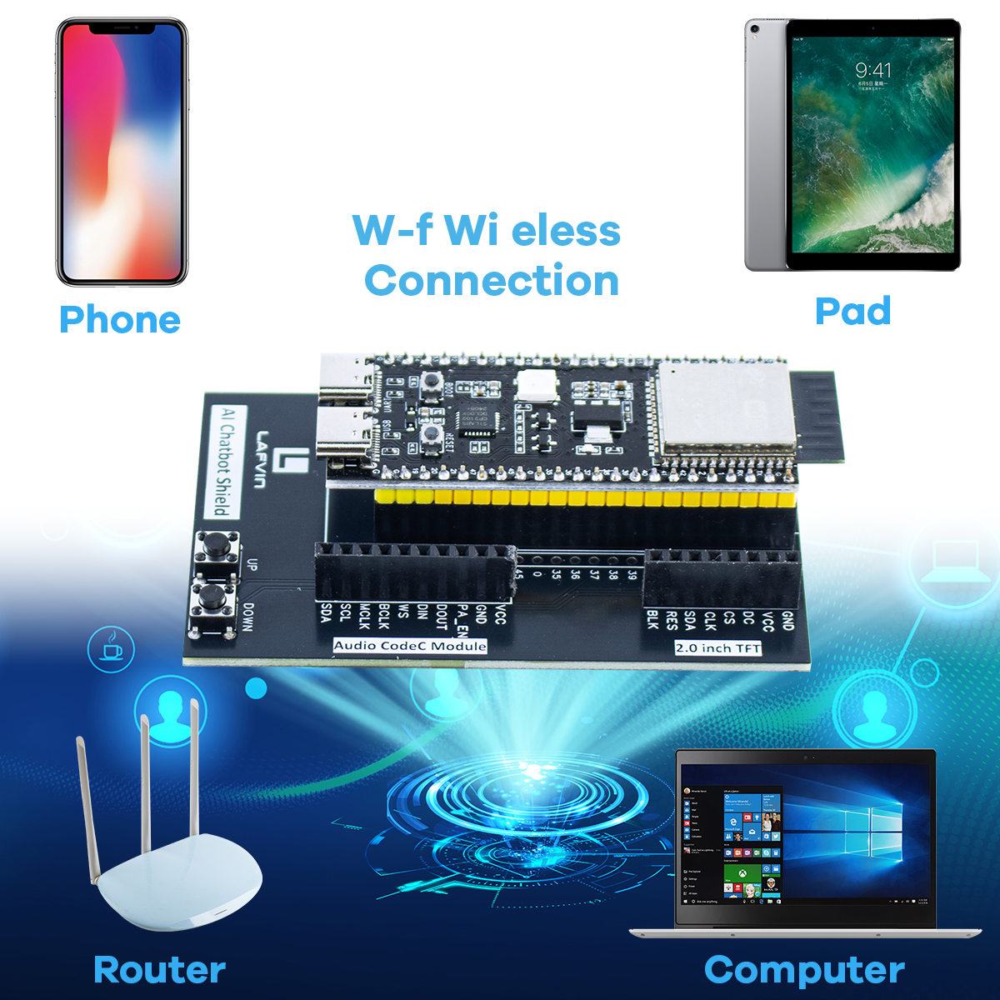
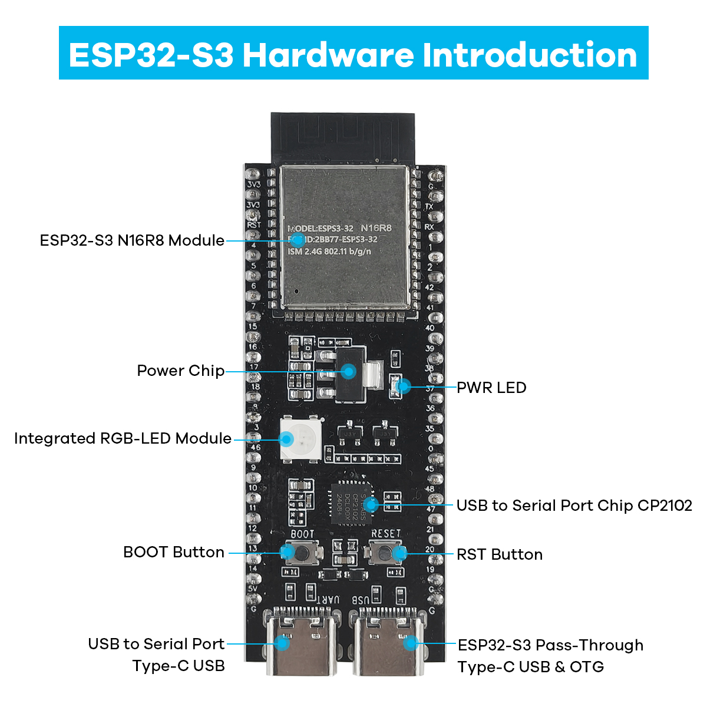
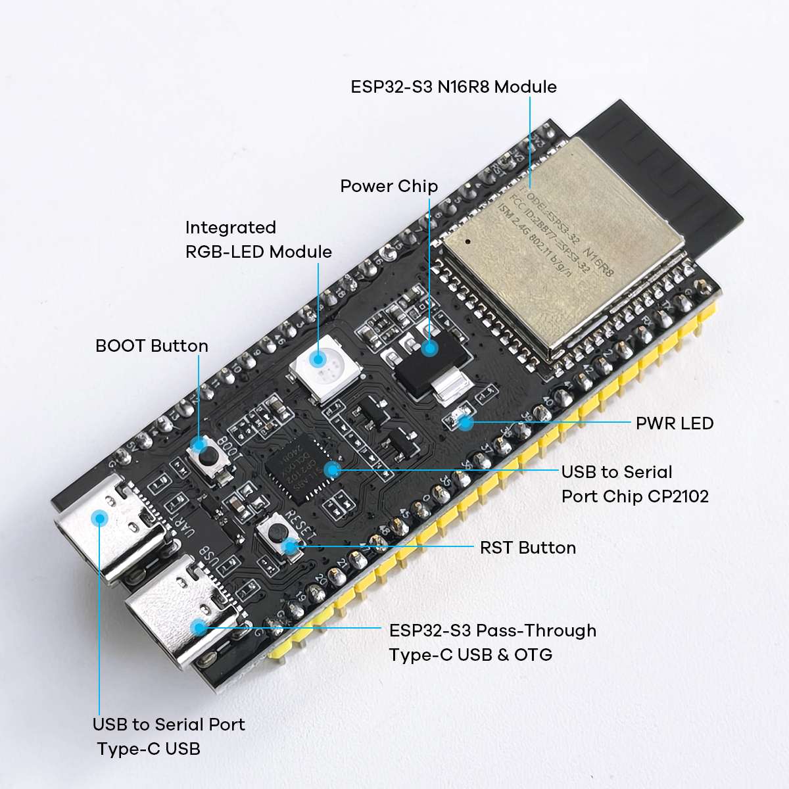
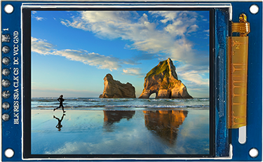
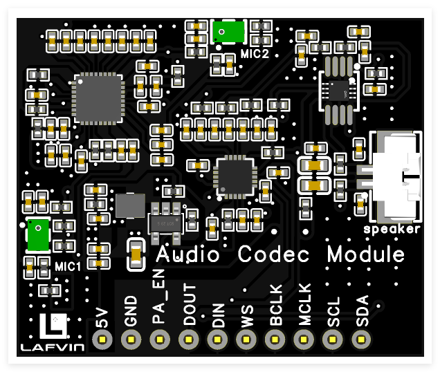
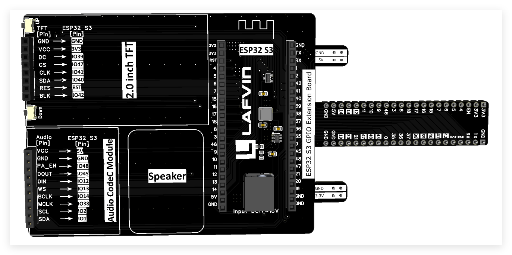
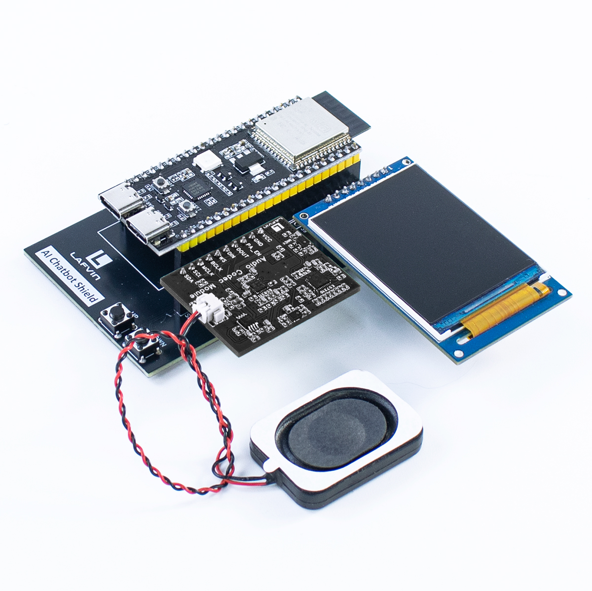

.. _hardware_intro:

Hardware Introduction
===========================

This document provides a detailed introduction to the hardware components, functions, and usage methods of the ESP32-S3 AI Chatbot.

.. _esp32s3_specs:

Main Controller - ESP32-S3
------------------------------------------

ESP32-S3 is the core processor of this project, providing powerful computing capabilities and rich interfaces.

**Key Features**

* Dual-core Xtensa LX7 processor with a maximum frequency of 240MHz
* Integrated Wi-Fi and Bluetooth dual-mode communication
* Rich peripheral interfaces, supporting various communication protocols
* Low power design, suitable for battery-powered applications
* Built-in neural network accelerator, supporting local AI computation

**Technical Specifications**

.. list-table::
   :widths: 30 70
   :header-rows: 0

   * - Processor
     - Dual-core Xtensa LX7, frequency up to 240MHz
   * - Memory
     - 512KB SRAM, 8MB PSRAM
   * - Storage
     - Supports up to 16MB Flash
   * - Wi-Fi
     - IEEE 802.11 b/g/n, supports 2.4GHz band
   * - Bluetooth
     - Bluetooth 5.0 and BLE
   * - GPIO
     - Up to 45 programmable GPIOs
   * - Interfaces
     - SPI, I2C, I2S, UART, USB OTG
   * - Operating Voltage
     - 3.0-3.6V
   * - Operating Temperature
     - -40°C to +85°C

.. _display_module:

Display Module
------------------------------------------

This project uses a 2.0-inch 240*320 SPI LCD display, based on the ST7789 controller, communicating with the ESP32-S3 via SPI interface.

**Key Features**

* Resolution: 240*320 pixels
* RGB color display
* IPS panel, wide viewing angle, and good visibility
* SPI interface, easy to connect

The display is mainly used for showing system status, message content, and interaction prompts.

.. _audio_module:

LAFVIN Audio Codec Module
------------------------------------------
The LAFVIN AI Chatbot utilizes the LAFVIN Audio Codec Module, which supports voice input and output functions, enabling the device to perform voice interactions.

**Key Features**

* High Signal-to-Noise Ratio: Ensures clear and accurate sound pickup.
* Built-in Digital Signal Processing (DSP): Enhances audio quality and performance.
* I2S Interface: Directly outputs digital audio signals, compatible with microcontrollers and processors.
* Dual Omnidirectional Microphones: Wide coverage for robust voice capture.
* Sufficient Volume Output: Ensures clear audio playback even in noisy environments.

.. _buttons:

Buttons and Interaction
------------------------------------------

The device provides physical buttons for simple operations and control:

1. The button connected to GPIO20 is for scrolling text upward
2. The button connected to GPIO19 is for scrolling text downward

.. _exp_board:

AI Chatbot Shield
------------------------------------------
The AI Chatbot Shield is an expansion board for the LAFVIN AI Chatbot, designed to simplify the wiring process and provide a plug-and-play solution for implementing AI Chatbot functionality.

   
.. _hardware_connection:

Hardware Connection Diagram
------------------------------------------

The following diagram shows how each hardware module is connected:

.. 扩展板和屏幕音频板连接(可能插到面包板上)

