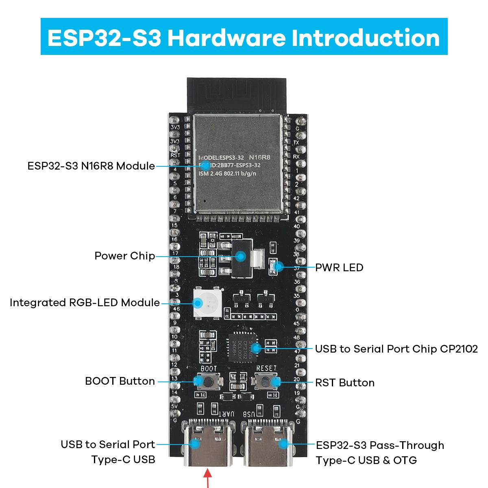
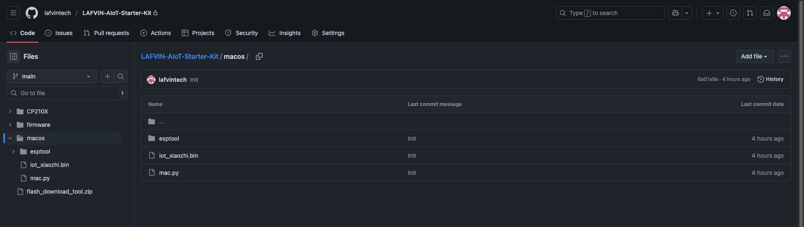
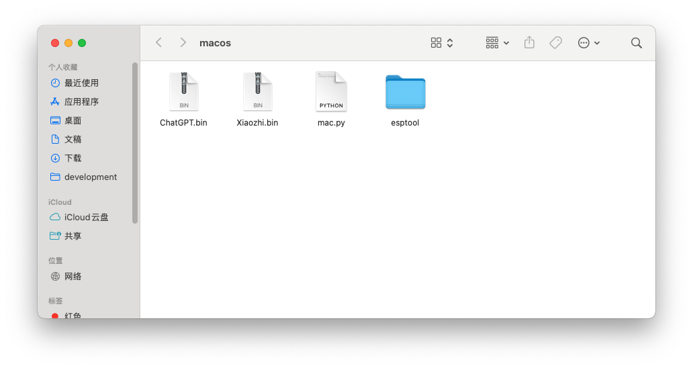
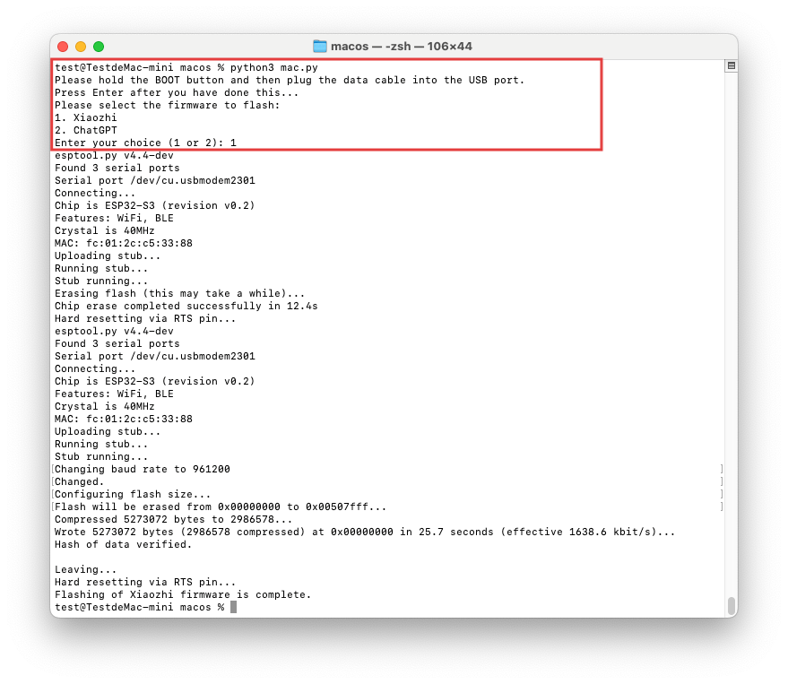

.. _install_driver:

Driver Installation
=========================

Windows System
^^^^^^^^^^^^^^^^^^^^^^^^^^^^^^^^^^^^^^^^^^

.. note::
   On Windows 11, the CP210x driver may install automatically after you connect the board to the computer. If no serial port appears in Device Manager, install the Silicon Labs CP210x driver manually.

**Check If CP210X Is Already Installed**

ESP32-S3 uses CP210X for code downloading. Before using it, we need to install the CP210X driver on our computer.

1. Connect your computer and ESP32-S3 with a USB cable (connect to the port indicated by the red arrow)

2. Go to your computer's main interface, select "This PC" and right-click to select "Manage".

.. figure:: img/driver1.png
   :align: center

3. Click "Device Manager". If your computer has already installed CP210X, you will see "USB-Enhances-SERIAL CP210X (COMx)". You can then proceed to the next step.

.. figure:: img/driver3.png
   :align: center

**Installing CP210X**

1. First, download the CP210X driver. Click `here <https://www.silabs.com/developer-tools/usb-to-uart-bridge-vcp-drivers>`_ to download the appropriate driver for your operating system.

.. figure:: img/driver3.png
   :align: center

If you don't want to download the installation package from the website, you can open "LAFVIN-AIoT-Starter-Kit/CP210X", as we have already prepared the installation package.

You can install it following the video below

.. video:: img/driver_ins.mp4
    :width: 100%

**Windows 11 Driver Troubleshooting**

If the CP210x driver cannot be installed or the serial port does not appear:

1. Make sure you are using a USB Type-C cable that supports data transfer.
2. Connect the cable to the ESP32-S3 ``UART`` port, not the ``USB`` port.
3. Open Device Manager and check both ``Ports (COM & LPT)`` and ``Other devices``.
4. If you see an unknown device or a CP210x device with a warning icon, right-click it and choose ``Update driver``.
5. Use the official Silicon Labs driver whenever possible. Avoid installing random driver packages from unofficial sources.
6. After installing the driver, unplug and reconnect the USB cable, or restart Windows if the COM port still does not appear.
7. If it still fails, contact support with your Windows version, a screenshot of Device Manager, and the driver package you tried to install.

.. _macos_upload:

macOS Firmware Upload (Alternative)
---------------------------------------------

1. Find the macOS folder in the GitHub repository. You can download the whole project to your local computer.

2. We have prepared the flashing tools and files for macOS in this folder.

3. Open the terminal, run ``python3 mac.py``, and the flashing interface will appear.

4. Press and hold the ``BOOT`` button on the ESP32-S3, insert the USB Type-C data cable, and press Enter to select the AI firmware. In this example, choose ``xiaozhi-iot.bin``.

5. Click Confirm. The program will complete the flashing process automatically.
6. After flashing is complete, press the ``RST`` button on the ESP32-S3 and wait for the device to restart.
7. After restarting, follow :ref:`xiaozhi_conf <xiaozhi_conf>` for network configuration and device binding in the backend.
