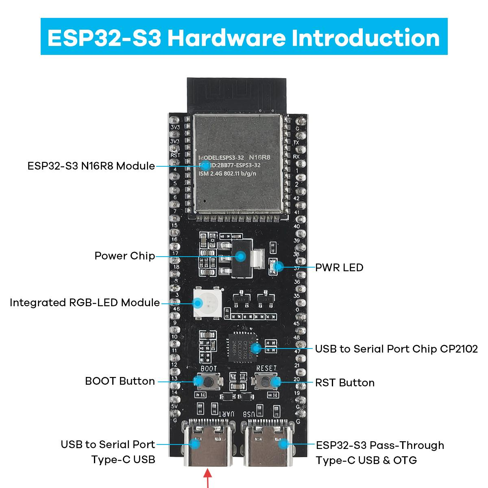

.. _install_driver:

Driver Installation
=========================

Windows System
^^^^^^^^^^^^^^^^^^^^^^^^^^^^^^^^^^^^^^^^^^

**Check If CP210X Is Already Installed**

ESP32-S3 uses CP210X for code downloading. Before using it, we need to install the CP210X driver on our computer.

1. Connect your computer and ESP32-S3 with a USB cable (connect to the port indicated by the red arrow)

2. Go to your computer's main interface, select "This PC" and right-click to select "Manage".

3. Click "Device Manager". If your computer has already installed CP210X, you will see "USB-Enhances-SERIAL CP210X (COMx)". You can then proceed to the next step.

**Installing CP210X**

1. First, download the CP210X driver. Click `here <https://www.silabs.com/developer-tools/usb-to-uart-bridge-vcp-drivers>`_ to download the appropriate driver for your operating system.

If you don't want to download the installation package from the website, you can open "LAFVIN-AIoT-Starter-Kit/CP210X", as we have already prepared the installation package.

You can install it following the video below

.. video:: img/driver_ins.mp4
    :width: 100%

.. _macos_upload:

MacOS Firmware Upload
---------------------------

1. First, find the macos folder in the Github repository, you can download the whole project to your local computer.

2. We have prepared the flashing tools and files for macos in this folder

3. You only need to open the terminal, then enter python3 mac.py, and this interface will appear

4. Then press and hold the boot button of the ESP32-S3, insert the Type-C data cable, and press Enter to select the AI firmware you want. Here we choose xiaozhi-iot.bin

5. Then click confirm, and the program will automatically complete the flashing process for you
6. After flashing is complete, press the reset button on the ESP32S3, and wait for the device to restart
7. After restarting, follow :ref:`xiaozhi_conf <xiaozhi_conf>` for network API configuration and adding the device in the backend
