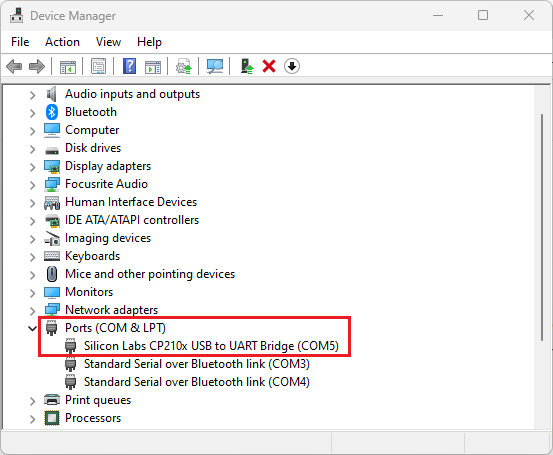

.. _online_flasher:

Online Flasher
======================

The online flasher is the recommended way to install firmware for first-time users. It lets you flash the ESP32-S3 board directly from the browser without installing a local development environment.

Prerequisites
------------------

* Chrome or Edge browser with Web Serial support
* ESP32-S3 board connected with a USB Type-C data cable
* Serial device visible in Device Manager or the system serial port list

.. warning::
   Charging-only USB cables can power the board but cannot be used for flashing.

.. note::
   If the board does not appear as a serial device, install the CP210x driver first and then try a different USB port.

Flashing Steps
------------------

#. Open the online flasher: `LAFVIN Web Flasher <https://lafvintech.github.io/Lafvin_Web_Flasher/>`_

   .. image:: img/olf2.png

#. Select your kit or device model.

   .. image:: img/olf3.png

#. Select the firmware to flash.

   .. image:: img/olf4.png

#. Select the firmware version.

   .. image:: img/olf5.png

#. Click ``Connect``. A serial port selection window will appear. Select your device, grant permission if prompted, and confirm the connection. When the connection succeeds, the button changes to ``Disconnect``.

   .. image:: img/olf6.png

   .. image:: img/olf7.png

#. Select the ``Flash Baud Rate`` and enable ``Erase Flash`` for the first flash or when you want a clean reinstall. Then click ``Flash``. The tool erases and writes the selected firmware automatically.

   .. image:: img/olf8.png

.. note::
   Erasing flash and writing firmware may take a few minutes. Keep the browser tab open and do not disconnect the cable.

After flashing is complete, restart the board. It should enter Wi-Fi provisioning mode so you can continue with :doc:`/Tutorial/0.quick_start`.

If ``Connect`` still cannot detect the board:

* install the driver from :doc:`/Appendix/install_driver`
* reconnect the board with a USB Type-C data cable
* retry in Chrome or Edge
* use the local flashing alternative in :doc:`/Tutorial/4.xiaozhi_ai`
