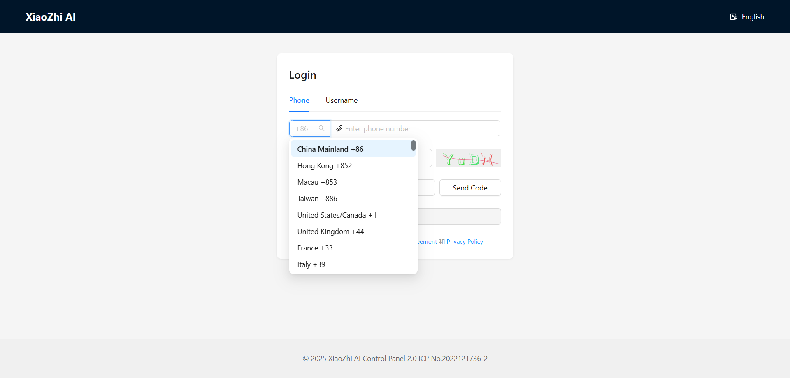
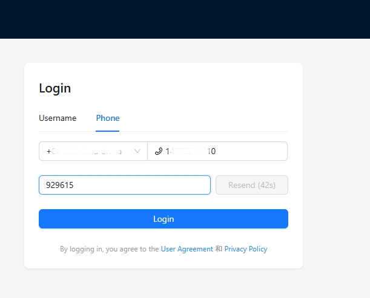
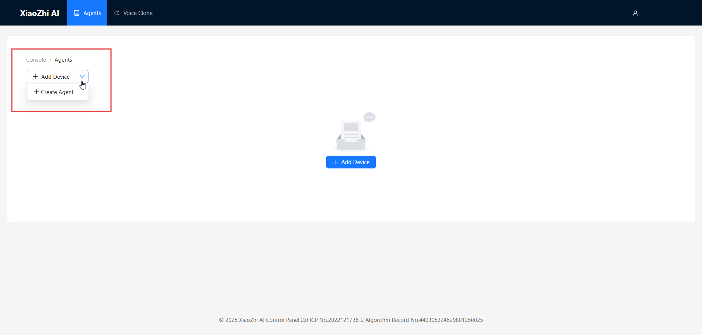
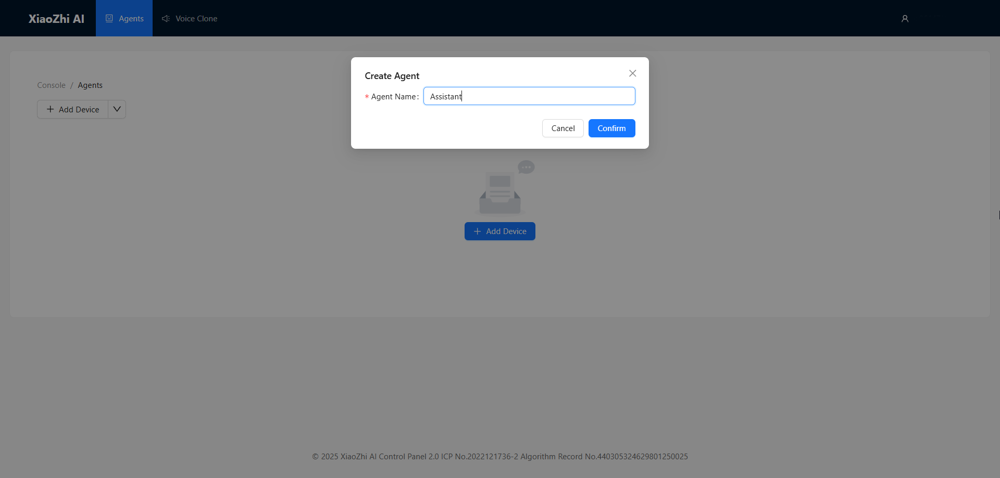
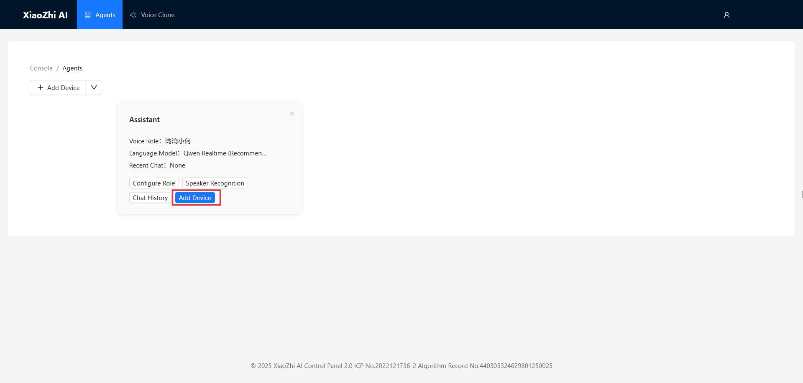
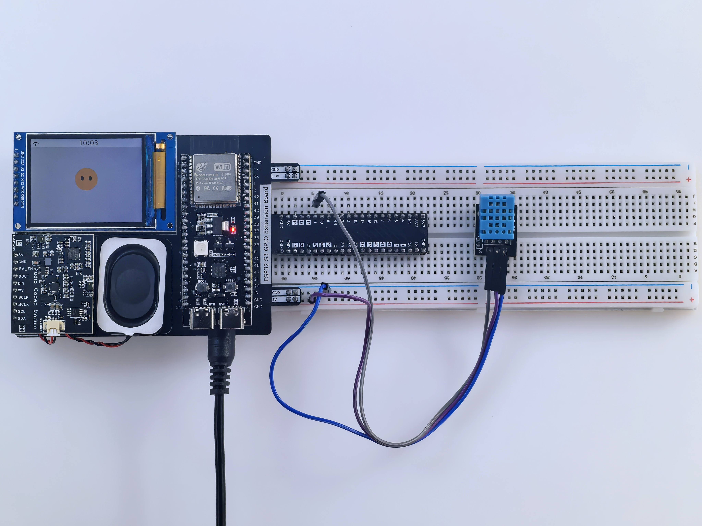
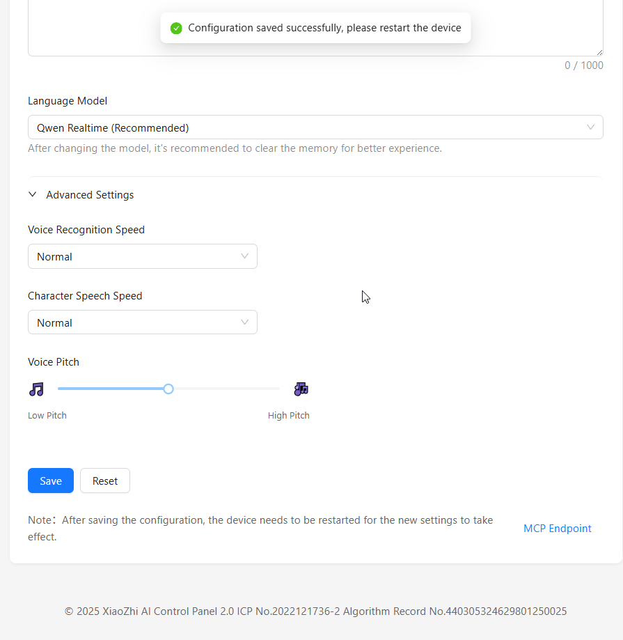

.. _quickstart:

Quick Start
=============

Use this page to get your LAFVIN AIoT Starter Kit online, bound to the Xiaozhi backend, and ready for its first voice conversation.

What You Will Finish
--------------------

In about 15 to 20 minutes, you will:

* flash the firmware
* connect the board to your 2.4 GHz Wi-Fi network
* bind the board to your Xiaozhi account
* start your first voice conversation

Before You Begin
----------------

Make sure you have:

* an ESP32-S3 board installed on the AI Chatbot IoT Shield
* a USB Type-C data cable
* Chrome or Edge for online flashing
* access to a 2.4 GHz Wi-Fi network
* a phone that can connect to the temporary Xiaozhi hotspot
* a Xiaozhi account, or a phone number that can receive the verification code

.. warning::
   Use a USB Type-C data cable. Charging-only cables can power the board but cannot be used for flashing.

.. note::
   ESP32-S3 supports 2.4 GHz Wi-Fi only. If your router exposes separate 2.4 GHz and 5 GHz networks, choose the 2.4 GHz network during setup.

Choose Your Setup Path
----------------------

.. list-table::
   :widths: 22 30 48
   :header-rows: 1

   * - Path
     - Best for
     - Requirements
   * - Online Flasher
     - First-time users
     - Chrome or Edge, USB Type-C data cable, browser serial permission
   * - Local Flashing
     - Users who cannot use the browser flasher
     - Firmware package and local flashing tool
   * - Secondary Development
     - Developers customizing the firmware
     - ESP-IDF environment and C++ experience

------------------------------------------------------------------------------------

Quick Setup
-----------

Step 1: Install the Driver
~~~~~~~~~~~~~~~~~~~~~~~~~~
If your board does not appear as a serial device, install the CP210x USB-to-UART driver for your operating system:

* :doc:`Windows/macOS Driver Installation </Appendix/install_driver>`

Step 2: Flash the Firmware Online
~~~~~~~~~~~~~~~~~~~~~~~~~~~~~~~~~
Use the online flasher as the default setup path. It does not require a local flashing tool or a separate firmware package.

* :doc:`Online Flasher </Appendix/online_flasher>`

.. note::
   If the online flasher cannot detect your board, install the driver first and then use the local flashing alternative in :doc:`/Tutorial/4.xiaozhi_ai`.

Step 3: Connect the Board to Wi-Fi
~~~~~~~~~~~~~~~~~~~~~~~~~~~~~~~~~~
1. After flashing, restart the board. It should enter Wi-Fi provisioning mode automatically.
2. On your phone, connect to the hotspot named ``Xiaozhi-XXXX``.
3. If the configuration page does not open automatically, enter ``http://192.168.4.1`` in your browser.
4. Select your 2.4 GHz Wi-Fi network, enter the password, and tap Save.
5. Wait for the board to restart and announce a 6-digit verification code.

.. note::
   Keep the board powered on after Wi-Fi setup. You will need the 6-digit verification code in the next step.

Step 4: Bind the Board in the Xiaozhi Backend
~~~~~~~~~~~~~~~~~~~~~~~~~~~~~~~~~~~~~~~~~~~~~
1. Open `Xiaozhi <https://xiaozhi.me/>`_ and sign in or create an account.
2. Open the console and create an agent.
3. Click ``Add Device``.
4. Enter the 6-digit verification code announced by the board.
5. Confirm the binding and wait for the board to restart.

.. figure:: img/sign2.png
   :align: center
   :alt: Xiaozhi SMS verification page

.. figure:: img/web6.png
   :align: center
   :alt: Enter the device verification code

Step 5: Start Your First Conversation
~~~~~~~~~~~~~~~~~~~~~~~~~~~~~~~~~~~~~
After the board restarts, press the wake button or say ``Hi, ESP`` or ``Sophia`` to start a voice conversation.

Post-Setup Functional Check
~~~~~~~~~~~~~~~~~~~~~~~~~~~
After firmware flashing, Wi-Fi setup, and backend binding are complete, use the checks below to confirm that the full system is working:

You can refer to :ref:`hardware_assembly` for the wiring diagrams and pin assignment table for each sensor and actuator. After the hardware connections are complete, use the voice checks below to confirm that the system is working correctly.

1. **Voice Test**: Say ``Hi, ESP`` and confirm that the assistant wakes up and responds.
2. **LED Test**: Say ``Hi, ESP, turn on LED`` to confirm that the RGB LED responds.
3. **Sensor Test**: Say ``Hi, ESP, check temperature`` to confirm that the sensor data path is working.

.. tip::
   If a hardware module does not respond, return to :doc:`/Tutorial/2.hardware_connect` and recheck the wiring before reflashing the firmware.

------------------------------------------------------------------------------------

Optional: Customize the Agent Role
~~~~~~~~~~~~~~~~~~~~~~~~~~~~~~~~~~
Open ``Configure Role`` if you want to change the assistant name, voice, language, or personality:

* Assistant Name: Name your AI assistant
* Voice Role: Select your preferred voice style
* Language Preference: Set the conversation language
* Role Introduction: Define the assistant personality
* Language Model: Select the model used by the backend

Sample prompt:
   ::

      I am a virtual assistant called {{assistant_name}}. I communicate exclusively in English with a natural, friendly voice. I provide helpful, accurate information and assist users with their queries while maintaining a conversational tone. I adapt my speaking style to match the user's needs and always aim to deliver clear, concise responses in fluent English.

.. figure:: img/web4.png
   :align: center
   :alt: Configure the assistant role

Success Checklist
-----------------

You are ready to continue if:

* the board restarts normally after binding
* the screen turns on and shows the main interface
* ``Hi, ESP`` wakes the assistant
* you can complete a short voice conversation

Next Steps
----------

* :doc:`Detailed Hardware Connection </Tutorial/2.hardware_connect>`
* :doc:`Software Preparation Guide </Tutorial/3.software_preparation>`
* :doc:`Xiaozhi AI Setup </Tutorial/4.xiaozhi_ai>`
