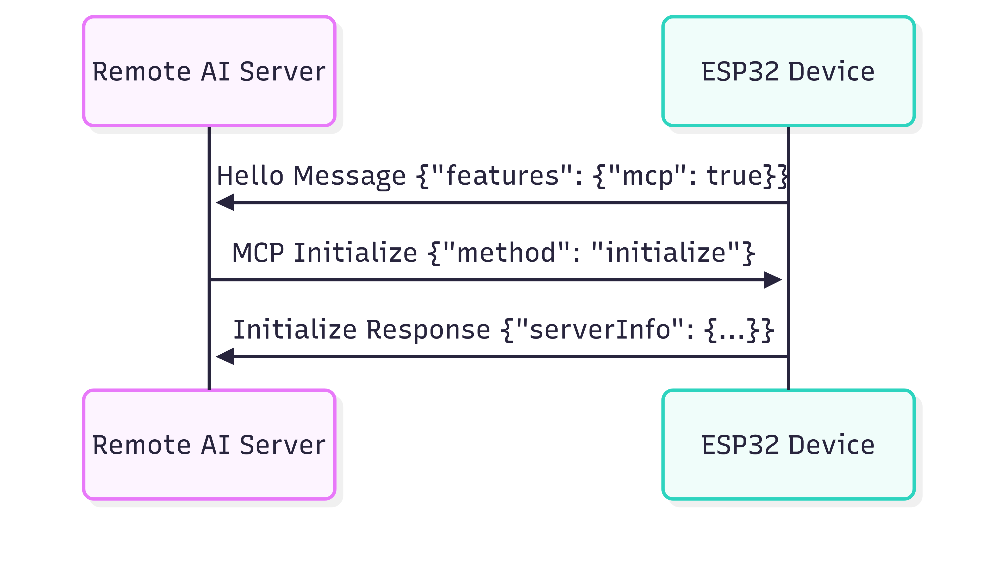
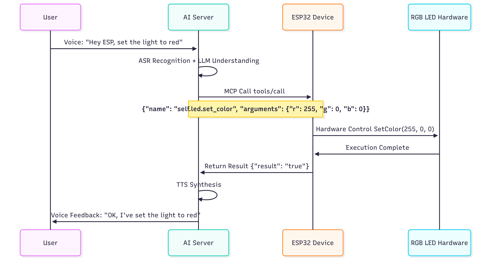
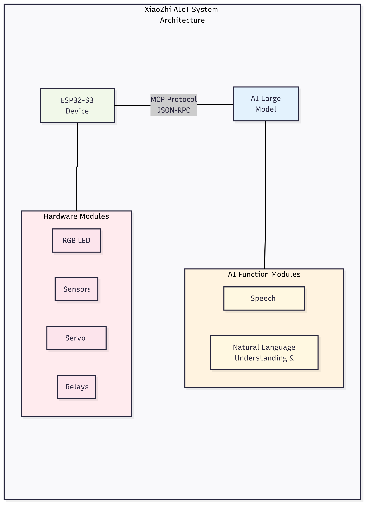

.. _tutorial_introduction:

1.Introduction
==========================

This chapter provides an in-depth introduction to the technical architecture, design philosophy, and innovative features of the Xiaozhi AIoT Intelligent Control System, helping you comprehensively understand this next-generation IoT control system based on the MCP protocol.

Technical Background
--------------------

xiaozhi-esp32 Open Source Project
~~~~~~~~~~~~~~~~~~~~~~~~~~~~~~~~~~~~~~~~

The Xiaozhi AIoT system is built upon the open-source `xiaozhi-esp32 project <https://github.com/78/xiaozhi-esp32>`_ developed by Xiage. This project is a mature ESP32 AI voice assistant framework with the following technical foundations:

* **Rich Hardware Ecosystem**: Supports over 70 different development board configurations
* **Multi-chip Platform**: ESP32-S3, ESP32-C3, ESP32-P4, and more
* **Complete Voice Pipeline**: Offline wake-up + Streaming ASR + LLM + TTS
* **Multi-language Support**: Chinese, English, Japanese, and other language recognition
* **Network Connectivity**: WiFi, 4G, and various connection methods

Building on this foundation, our project utilizes the MCP protocol to upgrade traditional voice assistants into AI-native IoT control centers.

MCP Protocol Technical Principles
----------------------------------

What is the MCP Protocol
~~~~~~~~~~~~~~~~~~~~~~~~

MCP (Model Context Protocol) is an emerging standard protocol specifically designed for interaction between AI large language models and external tools/systems. It is based on the JSON-RPC 2.0 specification and provides a standardized mechanism for tool discovery and invocation.

**Comparison with Traditional IoT Protocols**

Traditional IoT control methods have the following issues:

* **Protocol Fragmentation**: Different devices use different control protocols
* **High Learning Curve**: Users need to learn complex command formats  
* **Poor Scalability**: Adding new features requires modifying the entire system
* **Difficult AI Understanding**: Large models cannot directly understand device capabilities

Core advantages of the MCP protocol:

* **Standardization**: Unified JSON-RPC 2.0 message format
* **Self-describing**: Tools come with parameter and functionality descriptions
* **AI-friendly**: Large models can directly understand tool definitions
* **Easy Extension**: Dynamic registration of new tools without modifying clients

MCP Workflow
~~~~~~~~~~~~~~~~~~~~

**Connection Establishment and Tool Discovery**

   
   MCP Connection Establishment and Capability Negotiation Process

**Device Control Execution Flow**

   
   Complete flow from voice commands to hardware control

**Core Concept Explanation**

* **Tools**: Functional units provided by the device side, such as "Set LED Color", "Read Temperature"
* **Server**: ESP32 device acts as MCP server, registering and providing tools  
* **Client**: AI backend service acts as MCP client, discovering and invoking tools
* **Session**: Communication session between client and server

MCP Implementation in ESP32
~~~~~~~~~~~~~~~~~~~~~~~~~~~~

**Tool Registration Example**

In the xiaozhi-esp32 project, hardware functions are exposed to the AI system in the form of MCP tools:

.. code-block:: json

   {
     "name": "self.led.set_color",
     "description": "Set RGB LED color, supports RGB values from 0-255",
     "inputSchema": {
       "type": "object",
       "properties": {
         "r": {"type": "integer", "minimum": 0, "maximum": 255},
         "g": {"type": "integer", "minimum": 0, "maximum": 255}, 
         "b": {"type": "integer", "minimum": 0, "maximum": 255}
       }
     }
   }

Such tool definitions enable AI large models to:

1. **Understand Functionality**: Know this is a tool for controlling LED colors
2. **Master Parameters**: Understand that three RGB integer parameters from 0-255 are needed  
3. **Generate Calls**: Automatically generate correct call requests based on user voice input

System Architecture Design
---------------------------

Overall Architecture
~~~~~~~~~~~~~~~~~~~~

The xiaozhi-esp32 AIoT system adopts a layered architecture design, implementing a complete pipeline from user voice to hardware control.

**Software Architecture Layers**

.. code-block:: text

   ┌─────────────────────────────────────┐
   │          Application Layer          │  ← Voice interaction, device management
   ├─────────────────────────────────────┤
   │         MCP Protocol Layer          │  ← Tool registration, message processing
   ├─────────────────────────────────────┤  
   │       Hardware Abstraction Layer    │  ← Unified hardware interfaces
   ├─────────────────────────────────────┤
   │        Device Driver Layer          │  ← LED, sensors, servos, etc.
   ├─────────────────────────────────────┤
   │    System Layer (ESP-IDF/FreeRTOS)  │  ← Task scheduling, memory management
   └─────────────────────────────────────┘

**Key Design Features**

1. **MCP Protocol Layer**
   - Standardized tool registration mechanism
   - JSON-RPC 2.0 message processing
   - Asynchronous execution to avoid blocking
   - Error handling and state management

2. **Hardware Abstraction Layer**  
   - Unified hardware interface design
   - Support for 70+ development boards
   - Configurable GPIO mapping
   - Modular driver architecture

3. **Concurrent Processing**
   - FreeRTOS task scheduling
   - Non-blocking I/O operations
   - Real-time response guarantee
   - Memory-efficient management

System Technical Features
-------------------------

**Dual-Core Concurrent Architecture**

The dual-core design of ESP32-S3 achieves efficient task separation:

* **Core 0**: MCP protocol communication, WiFi connection, voice processing
* **Core 1**: Hardware I/O, sensor data collection, actuator control

**Memory Management Optimization**

* Core components use static memory to avoid fragmentation
* MCP message processing uses dynamic memory pools
* Real-time memory monitoring ensures stable system operation

Secondary Development Technical Requirements
--------------------------------------------

This project requires setting up Espressif's ESP-IDF environment and mastery of C++ development skills. It is suitable for technical personnel with embedded or IoT development background to customize and extend.

**Core Technical Requirements**

* **ESP-IDF 5.4+**: Espressif's official development framework
* **C++ Programming**: Modern C++ features, object-oriented design
* **Embedded Development**: FreeRTOS, hardware interface programming
* **Network Protocols**: JSON-RPC, WebSocket communication

For in-depth customization, it is recommended to refer to the official ESP-IDF documentation and the xiaozhi-esp32 open source project.
