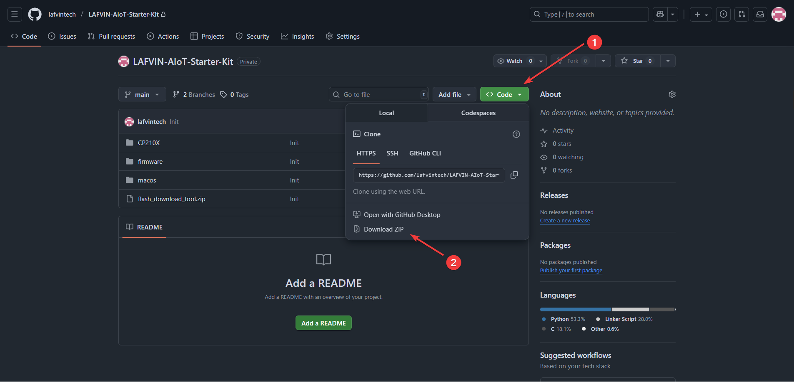

.. _software_preparation:

3.Software Preparation
======================

This section will guide you through downloading and flashing the software and firmware required for the LAFVIN AIoT Control Kit.

Flashing Software and Bin File Download
------------------------------------------

1. You can visit our repository: `GitHub Repository <https://github.com/lafvintech/LAFVIN-AIoT-Starter-Kit>`_  or directly download the zip package from `this link <https://codeload.github.com/lafvintech/LAFVIN-AIoT-Starter-Kit/zip/refs/heads/main>`_
2. The downloaded zip package includes the latest bin firmware, flashing tool, and drivers.
3. Save the downloaded firmware files to a location on your computer that is easy to access.

Before flashing, let's ensure that the drivers are correctly installed.
Please refer to :ref:`install_driver` for driver installation instructions.
