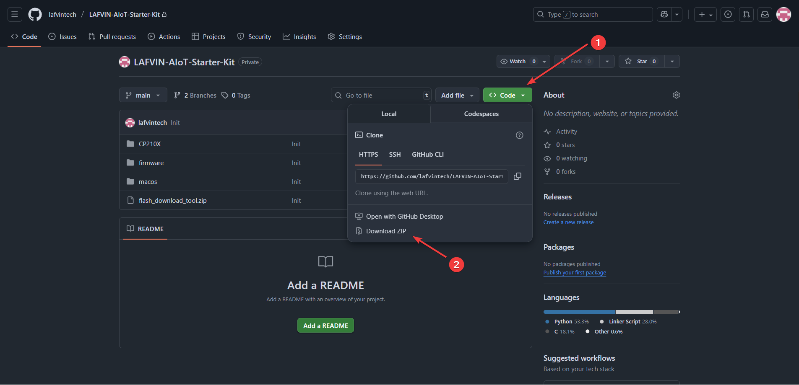

.. _software_preparation:

3.Software Preparation
======================

This section explains when you need the local firmware package and where to download it.

.. note::
   If you are using the :doc:`online flasher </Appendix/online_flasher>`, you can usually skip this page and continue with :doc:`/Tutorial/0.quick_start`.

Flashing Software and Bin File Download
------------------------------------------

1. Visit the `GitHub repository <https://github.com/lafvintech/LAFVIN-AIoT-Starter-Kit>`_ or download the project zip file from `this link <https://codeload.github.com/lafvintech/LAFVIN-AIoT-Starter-Kit/zip/refs/heads/main>`_.
2. The package includes the latest firmware binary, local flashing tools, and driver files.
3. Extract the package to a local folder that is easy to access.
4. Use the local package when:

   * the online flasher cannot detect your board
   * you need the Windows Flash Download Tools workflow
   * you are using the macOS local flashing workflow

Before flashing locally, make sure the CP210x driver is installed.
Please refer to :ref:`install_driver` for driver installation instructions.

Continue with:

* :doc:`Quick Start </Tutorial/0.quick_start>` for the default online setup path
* :doc:`Xiaozhi AI Setup </Tutorial/4.xiaozhi_ai>` for backend configuration and local flashing
