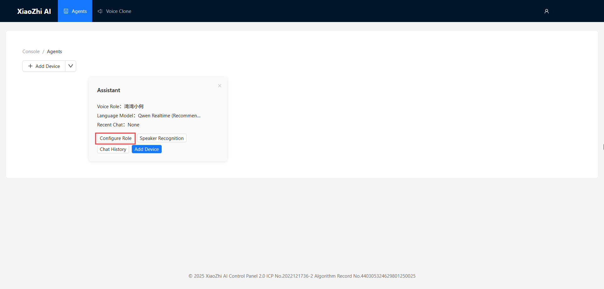

.. _xiaozhi_ai:

======================
4.Xiaozhi AI Setup
======================

Use this page to configure the Xiaozhi backend, customize the assistant role, and use the local flashing workflow when the online flasher is not available.

This project is based on `xiaozhi-esp32 <https://github.com/78/xiaozhi-esp32/blob/main/README_en.md>`_. If you want to add your own features, continue with secondary development after the standard setup path is working.

.. _xiaozhi_backend_setup:

Backend Setup
==============================================

Register a Xiaozhi Account
------------------------------------------

.. note::
   Xiaozhi account registration may require a phone number and SMS verification.

1. Visit the AI Chatbot Management System: `Xiaozhi.me <https://xiaozhi.me>`_
2. Click ``Console`` to enter the management backend.
3. Fill in the registration form:

   * Select your country or region.
   * Enter the phone number that will receive the verification code.
   * Complete the captcha.

4. Click ``Send Code`` and enter the SMS verification code to complete registration.
5. After registration, set a password in account management if you want to sign in again later from a different device.

.. figure:: img/sign0.png
   :align: center
   :alt: Xiaozhi sign-in page

.. figure:: img/sign1.png
   :align: center
   :alt: Xiaozhi sign-up form

.. figure:: img/sign2.png
   :align: center
   :alt: Xiaozhi SMS verification page

Create an Agent
------------------------------------------

1. Click ``Create Agent``.
2. Enter an agent name and confirm.
3. Open ``Configure Role`` on the new agent card.

.. figure:: img/web1.png
   :align: center
   :alt: Create Agent interface

.. figure:: img/web2.png
   :align: center
   :alt: Configure agent parameters

Configure the Agent Role
------------------------------------------

1. Configure the basic role settings:

   * Assistant Name: Name your AI assistant
   * Voice Role: Select the preferred voice
   * Language Preference: Select the conversation language
   * Role Introduction: Describe the assistant personality
   * Language Model: Select the backend model

2. Set the role prompt. You can start with the template below and customize it later:
   ::

      I am a virtual assistant called {{assistant_name}}. I communicate exclusively in English with a natural, friendly voice. I provide helpful, accurate information and assist users with their queries while maintaining a conversational tone. I adapt my speaking style to match the user's needs and always aim to deliver clear, concise responses in fluent English.

.. figure:: img/web4.png
   :align: center
   :alt: Configure the assistant role

3. Click ``Save`` to store the role configuration.

.. figure:: img/web5.png
   :align: center
   :alt: Save the assistant role

------------------------------------------------------------------------------------

Firmware Upload
===============
Online Flashing
-------------------
You can also use an online flashing tool. The advantage of this method is that you simply open the webpage, select your device and firmware version, and it requires no configuration. Once flashing is complete, you can start using it right away.

.. note::
   Online flashing is supported only in Chrome or Edge browsers.

.. warning::
   Use a USB Type-C cable that supports data transfer. A charging-only cable may power the board but will not work for flashing.

For detailed instructions on using the online flasher, see :ref:`Online Flasher <online_flasher>`.

Follow these steps:

   A. Open the `LAFVIN Web Flasher <https://lafvintech.github.io/Lafvin_Web_Flasher/>`_
   B. Select the following options:

      - Device: ``AIoT Starter Kit``
      - Firmware: ``Xiaozhi-Aiot``
      - Version: ``Xiaozhi-Aiot``

   C. Connect the development board to your computer using a USB Type-C data cable. Click ``Connect``, then select your device in the browser pop-up window and click ``Connect``.
   D. Click ``Flash`` to start flashing. Wait for the process to complete, then restart the device.

.. raw:: html

   

   
<strong>Local Flashing (Alternative)</strong>

1. Open the local flashing tool package from the downloaded project files.
2. Double-click ``Flash Download Tools`` and select the same options shown below.

.. list-table::
   :widths: 50
   :header-rows: 0

   * - .. figure:: img/flashtool1.png
          :width: 100%

3. Upload the firmware with the following settings:

   A. Click the ``Select File`` button and choose your downloaded firmware file in ``.bin`` format.
   B. In the address field, enter ``0`` or ``0x0``.
   C. Select the COM port that matches the ESP32-S3 board. Refer to :ref:`install_driver` if you need help finding the port.
   D. Use the baud rate shown in the flashing tool screenshot. If flashing fails, retry with a lower baud rate.
   E. Click ``START`` to begin writing the firmware.

   .. figure:: img/flashtool2.png
      :align: center
      :width: 80%

   .. figure:: img/flash_xiaozhi.png
      :align: center
      :width: 80%

4. After flashing is complete, press the ``RST`` button on the development board.
5. The board should restart and enter Wi-Fi provisioning mode.
6. Continue with :ref:`xiaozhi_conf` to connect the board to Wi-Fi and bind it in the backend.

If you are using macOS and need a local flashing path, refer to :ref:`macos_upload`.

.. raw:: html

   

------------------------------------------------------------------------------------

.. _xiaozhi_conf:

Bind the Device
------------------------------------------

1. Keep the board powered on after Wi-Fi configuration.
2. In the agent page, click ``Add Device``.
3. Enter the 6-digit verification code announced by the board.
4. Confirm the binding and wait for the board to restart.

.. figure:: img/web6.png
   :align: center
   :alt: Bind the board with a verification code

After the restart completes, say ``Hi, ESP`` to start the first conversation.

.. _firmware_upload:

------------------------------------------------------------------------------------

.. _alternative_backend:

Alternative Backend and Privacy Options
=========================================

If you do not want to register with a phone number, want to use a different LLM, or prefer to keep more control over your data flow, you can explore the self-hosted server projects listed in the `xiaozhi-esp32 Related Open Source Projects <https://github.com/78/xiaozhi-esp32#related-open-source-projects>`_ section.

This path usually requires you to:

* deploy your own compatible backend service
* modify the firmware source code so the device points to your new server
* rebuild and flash the firmware again

.. warning::
   The LAFVIN kit documentation and the workflows in this guide are tested only with the official Xiaozhi server at ``xiaozhi.me``. We do not verify compatibility, deployment steps, privacy behavior, or long-term stability for third-party or self-hosted servers in this tutorial.

.. note::
   Self-hosting is an advanced workflow intended for users who are comfortable with backend deployment, ESP-IDF builds, firmware changes, and credential management.

