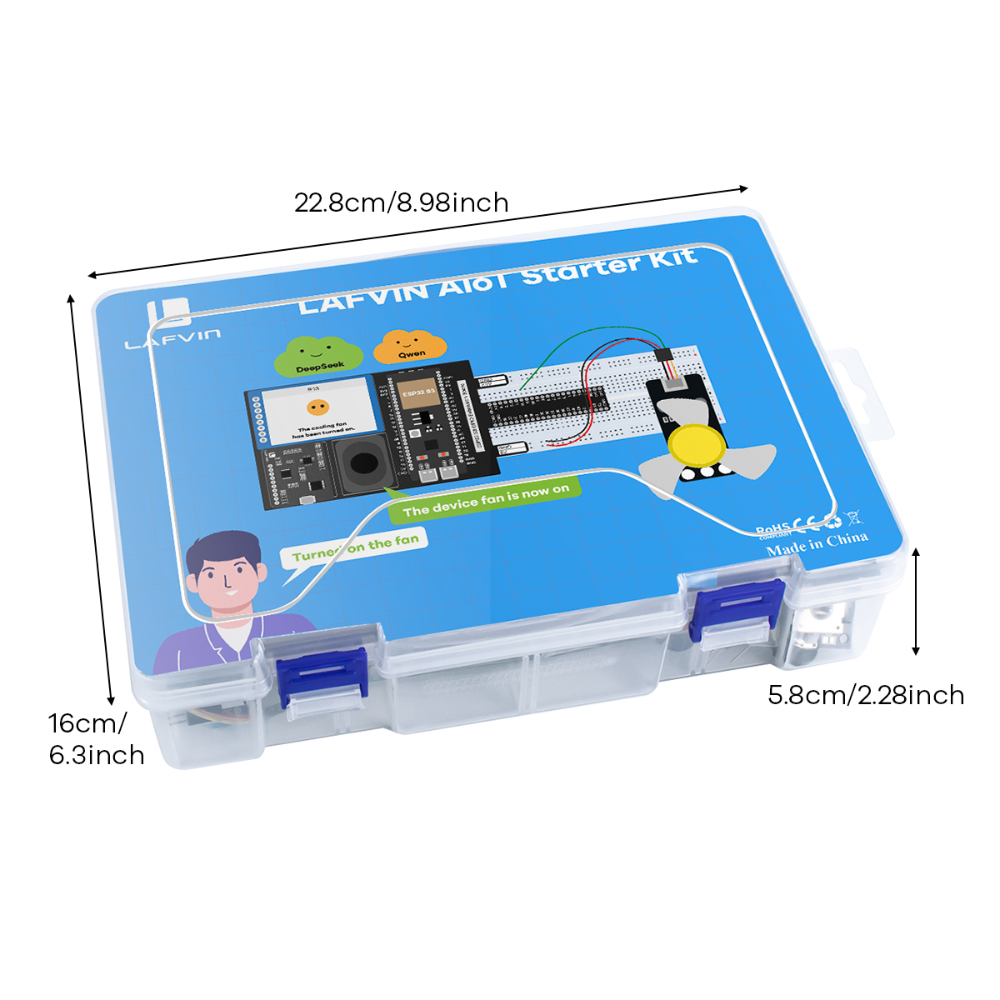

.. _about-this-kit:

==============
About This Kit
==============

LAFVIN AIoT Starter Kit
=======================

Project Overview
================
.. 下面的开源内容可以增加我们已经开源的src分支网址

The LAFVIN AIoT Starter Kit is built on the open-source `xiaozhi-esp32 project <https://github.com/78/xiaozhi-esp32>`_. It uses the ESP32-S3 as the main controller and applies the MCP (Model Context Protocol) to voice-driven hardware control.

With natural language commands, users can control lights, read sensors, and trigger connected devices. The kit is suitable for beginners learning IoT and AI workflows, and it also provides a practical starting point for prototyping and secondary development.

Key Features
============

* **AI-Native Control**: The backend can discover and invoke device tools through MCP.
* **Voice Interaction**: Use natural language commands such as ``Hi, ESP, turn the light red``.
* **Multi-Module Starter Kit**: Includes lighting, sensing, motor, fan, and relay modules.
* **Beginner-Friendly Setup**: Supports browser-based flashing and guided backend binding.
* **Open Source Foundation**: Built on the mature xiaozhi-esp32 ecosystem.

Main Functions
==============

**Smart Lighting**

* RGB LED color control and breathing effects
* WS2812 LED strip animation modes such as police mode and rainbow chase

**Environmental Monitoring**

* DHT11 temperature and humidity sensing
* Rain and soil moisture detection

**Smart Control**

* Servo angle control
* Fan on and off control
* Two-channel relay control

Application Scenarios
=====================

.. _applications:

* **Smart Home Control Center**: Environmental monitoring, lighting control, and device integration
* **Educational Experiment Platform**: IoT principles, AI interaction, and sensor application demos
* **Maker Development Tool**: Rapid prototyping for AIoT projects
* **Agricultural IoT**: Soil monitoring and automation experiments
* **Office Environment Management**: Environmental monitoring and device status demos

Hardware Components
===================

**Main Controller Module**

.. list-table::
   :header-rows: 1
   :widths: 40 15 35
   :align: center

   * - Component Name
     - Quantity
     - Function Description
   * - ESP32-S3 Development Board
     - 1
     - Main controller with Wi-Fi and Bluetooth support for AI voice processing
   * - AI Chatbot IoT Shield & Breadboard
     - 1
     - Hardware connection and expansion platform

**Sensor Modules**

.. list-table::
   :header-rows: 1
   :widths: 40 15 35
   :align: center

   * - Component Name
     - Quantity
     - Function Description
   * - DHT11 Temperature & Humidity Sensor
     - 1
     - Environmental temperature and humidity detection
   * - Rain Sensor
     - 1
     - Water detection for weather and automation demos
   * - Soil Moisture Sensor
     - 1
     - Soil moisture detection for irrigation experiments

**Actuator Modules**

.. list-table::
   :header-rows: 1
   :widths: 40 15 35
   :align: center

   * - Component Name
     - Quantity
     - Function Description
   * - RGB LED Module
     - 1
     - Tri-color LED with adjustable colors and breathing light effects
   * - WS2812 Smart LED Strip
     - 1
     - Programmable color LED strip with multiple lighting modes
   * - SG90 Servo Motor
     - 1
     - Precision angle control from 0 to 180 degrees
   * - 5V DC Fan
     - 1
     - Basic airflow control module
   * - 2-Channel Relay Module
     - 1
     - External device switching module

**Connection Accessories**

.. list-table::
   :header-rows: 1
   :widths: 40 15 35
   :align: center

   * - Accessory Name
     - Quantity
     - Purpose Description
   * - Dupont Jumper Wires
     - Multiple
     - Signal connection between modules
   * - USB Data Cable
     - 1
     - Firmware flashing and basic power connection
   * - Power Adapter
     - 1
     - Included external power supply for stable full-system operation

**Software Resources**

.. list-table::
   :header-rows: 1
   :widths: 40 60
   :align: center

   * - Software Component
     - Description
   * - Pre-compiled Firmware
     - ESP32 firmware with complete MCP tools
   * - Xiaozhi Backend Service
     - Provides voice interaction, device binding, and MCP request handling
   * - Development Toolchain
     - ESP-IDF example code

.. note::
   This kit is designed for education, demos, and development. Use the included external power adapter for stable full-module operation, and use a USB Type-C data cable for flashing.
