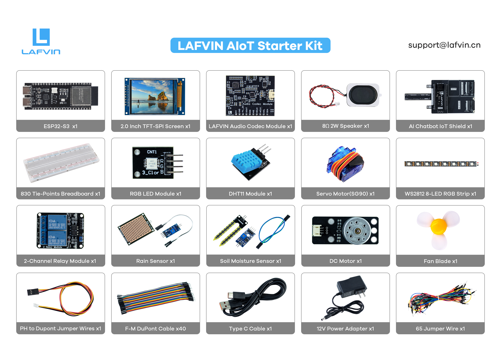

Components List
----------------------

.. list-table:: Hardware Components List
   :widths: 30 15 55
   :header-rows: 1

   * - Component Name
     - Quantity
     - Function Description
   * - ESP32-S3 Development Board
     - 1
     - Main controller with integrated WiFi/Bluetooth, supports AI voice processing
   * - AI Chatbot IoT Shield
     - 1
     - Provides module connection platform with external power support
   * - Breadboard
     - 1
     - Provides module connection platform with external power support
   * - RGB LED Module
     - 1
     - Tri-color LED with PWM color adjustment and breathing light effects
   * - DHT11 Temperature & Humidity Sensor
     - 1
     - Detects environmental temperature (0-50°C) and humidity (20-95%RH)
   * - SG90 Servo Motor
     - 1
     - Precision angle control, 0-180 degree range
   * - WS2812 Smart LED Strip
     - 1
     - Programmable RGB LED strip with 8 LEDs
   * - DC Fan
     - 1
     - Environmental regulation fan, maximum current 200mA
   * - 2-Channel Relay Module
     - 1
     - 5V relay capable of controlling AC/DC loads, maximum 10A
   * - Rain Sensor
     - 1
     - Detects water drops, outputs digital switch signal
   * - Soil Moisture Sensor
     - 1
     - Detects soil water content, outputs analog voltage signal
   * - Dupont Jumper Wires
     - Multiple
     - Male-to-male, male-to-female, female-to-female connection wires in various colors
   * - USB Data Cable
     - 1
     - Type-C interface for program download and debugging
   * - 9V/2A Power Adapter
     - 1
     - External power supply to ensure stable system operation